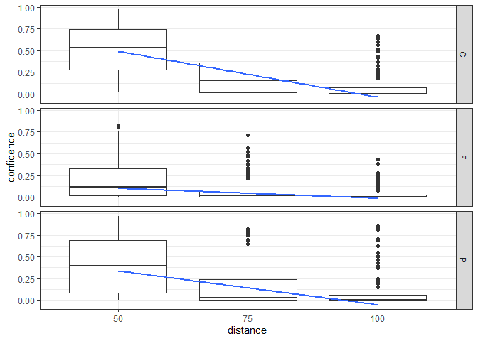

ARU cardinal transmission
================
Sunny Tseng
2023-02-07

## Library

``` r
library(here)
library(tidyverse)
```

## Import data

``` r
data <- read_csv(here("cardinal_playback.csv"))
```

``` r
# have a brief check for the imported data. 
data
```

    ## # A tibble: 1,626 × 10
    ##    date       time   location beaufort ARU   plot_type direction dista…¹ song_…²
    ##    <date>     <time> <chr>       <dbl> <chr> <chr>     <chr>       <dbl>   <dbl>
    ##  1 2022-05-01 08:00  PB              0 PB    PB        N               0       1
    ##  2 2022-05-01 08:00  PB              0 PB    PB        N               0       2
    ##  3 2022-05-01 08:00  PB              0 PB    PB        N               0       3
    ##  4 2022-05-01 08:00  PB              0 PB    PB        N               0       4
    ##  5 2022-05-01 08:00  PB              0 PB    PB        N               0       6
    ##  6 2022-05-01 08:00  PB              0 PB    PB        N               0       7
    ##  7 2022-06-14 11:48  14_35           0 NEW   F         E              50       1
    ##  8 2022-06-14 11:48  14_35           0 NEW   F         E              50       2
    ##  9 2022-06-14 11:48  14_35           0 NEW   F         E              50       3
    ## 10 2022-06-14 11:48  14_35           0 NEW   F         E              50       4
    ## # … with 1,616 more rows, 1 more variable: confidence <dbl>, and abbreviated
    ## #   variable names ¹​distance, ²​song_exp

``` r
# filter out non-necessary data and standardize the object type.
data_clean <- data %>%
  filter(distance != 0) %>%
  mutate(beaufort = as_factor(beaufort),
         distance = as_factor(distance),
         song_exp = as_factor(song_exp)) 
data_clean
```

    ## # A tibble: 1,620 × 10
    ##    date       time   location beaufort ARU   plot_type direction dista…¹ song_…²
    ##    <date>     <time> <chr>    <fct>    <chr> <chr>     <chr>     <fct>   <fct>  
    ##  1 2022-06-14 11:48  14_35    0        NEW   F         E         50      1      
    ##  2 2022-06-14 11:48  14_35    0        NEW   F         E         50      2      
    ##  3 2022-06-14 11:48  14_35    0        NEW   F         E         50      3      
    ##  4 2022-06-14 11:48  14_35    0        NEW   F         E         50      4      
    ##  5 2022-06-14 11:48  14_35    0        NEW   F         E         50      6      
    ##  6 2022-06-14 11:48  14_35    0        NEW   F         E         50      7      
    ##  7 2022-06-14 11:48  14_35    0        NEW   F         E         75      1      
    ##  8 2022-06-14 11:48  14_35    0        NEW   F         E         75      2      
    ##  9 2022-06-14 11:48  14_35    0        NEW   F         E         75      3      
    ## 10 2022-06-14 11:48  14_35    0        NEW   F         E         75      4      
    ## # … with 1,610 more rows, 1 more variable: confidence <dbl>, and abbreviated
    ## #   variable names ¹​distance, ²​song_exp

## Data visualization

Email from Ken: I was simply trying to run a boxplot to look at the data
with the three distances (50, 75 & 100) on the X axes, and Detection
Confidence on the Y axes, with the Forest, Control and Partial Cut
treatments as separate boxes. I was then trying to insert a line on top
of each so I could see how confidence decreased with distance, and also
be able to see how the forest treatment affected overall confidence at
each distance. The second ggplot was the closest I could come to what I
was trying to achieve, but it is a really weird way to have to get the
visual! Maybe distance has to be a factor for this to work instead of an
integer? Just not sure that would have the X axes spread out in a proper
linear fashion.

``` r
data_clean_med <- data_clean %>% 
  group_by(distance, plot_type) %>%
  summarize(median_confidence = median(confidence)) %>%
  mutate(distance = as.numeric(distance)) # in order to fit the lm
  
  #lm(median_confidence ~ distance %>% as.numeric(), data = .) %>%
  #coef()

aru_distance <- data_clean %>%
  ggplot() +
    geom_boxplot(aes(x = distance, y = confidence)) +
    geom_smooth(aes(x = distance, y = median_confidence), method = "lm", se = FALSE, data = data_clean_med) +
    facet_grid(rows = vars(plot_type)) +
    theme_bw()
    
aru_distance
```

<!-- -->
